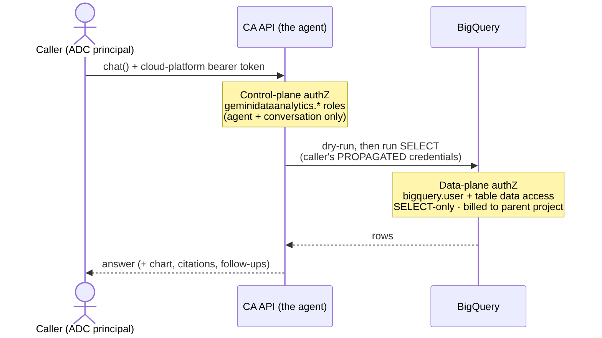
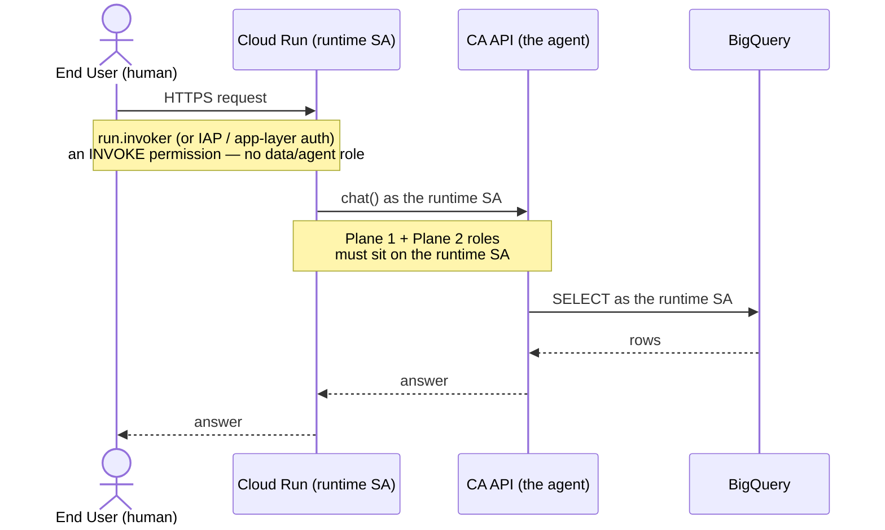

# Conversational Analytics API (GDA) Integration Guide

This guide walkthroughs four approaches for interacting with BigQuery data using the Gemini Data Analytics (`geminidataanalytics_v1alpha`) API: **Stateless Chat** (inline context), **Persistent Agent Chat** (saved context, stateless chat — *no companion API needed*), **Stateful Conversation** (server-managed history — *requires companion API*), and **A2A streaming** (surfaces the *verified/example-query matched* signal as dedicated message parts). For the IAM model behind all of them — who can use the agent, whose identity reaches BigQuery, and how that changes on Cloud Run — see [**🔐 Permissions & Identity**](#-permissions--identity) and [**☁️ Deployment & Identity Models**](#-deployment--identity-models).

---

## 🛠 Environment & Usage

### 🛠 setup

To pick up and run immediately, follow these steps to create your environment and install dependencies:

#### 1. Create a Virtual Environment
You can use standard Python `venv`:

```bash
# Create the virtualenv
python3 -m venv venv_caapi

# Activate the virtualenv
source venv_caapi/bin/activate
```

#### 2. Install Dependencies
Install the required Google Cloud SDK for Gemini Data Analytics:

```bash
pip install google-cloud-geminidataanalytics
```

#### 3. Authentication
Ensure Application Default Credentials (ADC) are active for the project:

```bash
gcloud auth application-default login
```

### ▶️ Running the Scripts

Activate your virtual environment and run the scripts using your `gcloud` configuration:

```bash
# Activate venv
source venv_caapi/bin/activate

# Execute Stateless Chat (Inline Context)
python3 inline_chat/main.py

# Execute Persistent Agent Chat (Saved Context, STATELESS chat — no companion API)
python3 agent_stateless/main.py

# Execute Stateful Conversation (server-managed history — needs companion API)
python3 agent_stateful/main.py

# Execute A2A streaming (captures the "verified query matched" signal)
python3 agent_a2a/main.py

# Any of them also accepts --parse to decode the stream into a typed summary
python3 agent_stateless/main.py --parse
```

All four scripts use the **same question and context** (same datasource, system
instruction, and one verified `example_query`) so their outputs are directly
comparable. By default each prints the **raw, verbatim** stream response; add
`--parse` to any of them to decode each streamed message into a compact, typed
summary (see *Parsing the Stream* below).

### 📁 Repo Layout

Each script lives in its own folder next to a captured `output.verbatim.txt` from a sample run:

```
inline_chat/       # Inline context, native SDK, stateless chat
  ├── main.py
  ├── output.verbatim.txt  # captured verbatim run
  └── output.parsed.txt    # captured `--parse` run (typed summary)
agent_stateless/   # Published agent, native SDK, stateless chat (DataAgentContext)
  ├── main.py
  ├── output.verbatim.txt
  └── output.parsed.txt
agent_stateful/    # Published agent, native SDK, stateful chat (ConversationReference)
  ├── main.py
  ├── output.verbatim.txt
  └── output.parsed.txt
agent_a2a/         # Published agent, A2A HTTP stream (verified-query match parts)
  ├── main.py
  ├── output.verbatim.txt
  └── output.parsed.txt
cloud_run_demo/    # Deployable app showing Cloud Run identity models (SA / impersonation / end-user OAuth)
  ├── app.py               # chats a published agent (DataAgentContext); IDENTITY_MODE toggles the identity
  ├── ensure_agent.py      # create/update the published Data Agent once
  ├── requirements.txt
  ├── Dockerfile
  ├── config.env.example   # copy to config.env (gitignored) and fill in
  ├── deploy.sh            # gcloud run deploy (explicit --project)
  ├── setup-iam.sh         # grant CA + BQ roles / run.invoker / tokenCreator
  ├── validate_identity.sh # empirical proof: control/data identity is coupled for BQ
  └── README.md
```

---
## 🔐 Permissions & Identity

Access to the Conversational Analytics API splits into **two independent planes**,
enforced by **different IAM** — and, importantly, potentially by **different
identities**:

*   **Control plane** — permission to use the *agent* itself (create it, chat with
    it). Governed by `geminidataanalytics.*` roles.
*   **Data plane** — permission to read the *underlying BigQuery data*. Governed by
    your **BigQuery** IAM, evaluated against the **caller's own credentials**,
    which the API propagates to BigQuery.

The single most important fact: **CA API roles control the agent, not the data.
BigQuery is queried under the caller's identity — not a separate agent/service
identity.**

### 🗺️ The two planes at a glance



### 🛡️ Plane 1 — Access to the agent (control plane)

These predefined roles gate `create` / `list` / `get` / `chat` / `update` /
`delete` on the `dataAgent` (and its conversations). They say **nothing** about
what data the agent can read.

| Role | Key permissions | Used by (this repo) |
|---|---|---|
| `roles/geminidataanalytics.dataAgentCreator` | `dataAgents.create`, `locations.chat` | creating the persistent agent (`agent_stateless` / `agent_stateful` / `agent_a2a`) |
| `roles/geminidataanalytics.dataAgentUser` | `dataAgents.list` / `get` / `chat` | chatting with a published agent |
| `roles/geminidataanalytics.dataAgentStatelessUser` | `locations.chat` | `inline_chat` (no saved agent) |
| `roles/geminidataanalytics.dataAgentOwner` | + `update` / `delete` / `get`\|`setIamPolicy` | sharing / updating an agent's context |

> [!NOTE]
> Stateful conversations (`ConversationReference`, `agent_stateful/main.py`)
> additionally require `roles/cloudaicompanion.user` **and** the
> `cloudaicompanion.googleapis.com` API — this is the IAM counterpart to the
> `[!CAUTION]` in the *Persistent Agent — Stateless Chat* section above.

**APIs to enable:** `geminidataanalytics.googleapis.com` and
`bigquery.googleapis.com` (plus `cloudaicompanion.googleapis.com` for stateful
conversations).

### 🔑 Plane 2 — Access to the BigQuery table (data plane)

This is the crux — *whose* identity reads the data, and what it needs.

*   **Whose identity?** BigQuery is queried under the **caller's own credentials**,
    which the CA API propagates — **not** an agent or service identity. Per the
    docs, the API "queries the connected data source … by using **that user's
    credentials**." In this repo that principal is whoever ran
    `gcloud auth application-default login` (and, for `agent_a2a/main.py`, the
    bearer token minted from that same ADC).
*   **Constructing the query vs. executing it — one identity, not two.** The
    schema/metadata read the agent uses to *reason about and build* the SQL **and**
    the *execution* of the generated `SELECT` both run as the **same caller**,
    each gated by that caller's BigQuery IAM. The docs do **not** split these into
    separate identities or role sets.

| Role | Grants | Covers |
|---|---|---|
| `roles/bigquery.user` (on the billing project) | `bigquery.jobs.create` | dry-run + running the query job; billing |
| `roles/bigquery.dataViewer` (on the dataset/table) | `bigquery.tables.get`, `bigquery.tables.getData` | reading schema/metadata to **construct** the SQL **and** reading rows on **execute** |

This repo makes the split concrete: it reads
`bigquery-public-data.san_francisco.street_trees` (a **public** table any
authenticated principal can read) while jobs bill to a **separate** project
(`kenly-dev-auto-240320261552`) — data-read grant on the *source* table,
job-run/billing grant on the *parent* project.

> [!TIP]
> **The agent is read-only.** Before running, the CA API does a **dry-run** on the
> generated SQL and permits **`SELECT` only** — all DDL/DML is blocked. You can
> also cap scanned bytes with `big_query_max_billed_bytes`. So even a caller with
> write IAM cannot mutate data *through* the agent.

> [!IMPORTANT]
> **Agent IAM ≠ data IAM.** A principal can be `dataAgentUser` on the agent yet
> still get a BigQuery *permission denied* if it lacks `dataViewer` on the table —
> the two planes are checked independently. Because there is **no separate agent
> identity** for BigQuery, least-privilege lives on the **caller's** own BigQuery
> grants. (When deployed behind Cloud Run, "the caller" changes — see below.)

### ☁️ Scenario — deployed behind Cloud Run (who is the "caller"?)

A common production shape: your CA-API code runs on **Cloud Run** and end users
invoke *only* Cloud Run. The key insight: **inside Cloud Run,
`google.auth.default()` resolves to the Cloud Run runtime *service account* via
the metadata server.** So "the caller" from both planes becomes the **Cloud Run
SA** by default — the end user's identity stops at Cloud Run's front door and does
**not** reach the CA API or BigQuery on its own.



The permission table shifts — roles move **from the human onto the SA**, plus a
new invoke row:

| Principal | Needs | Why |
|---|---|---|
| End user (human) | `roles/run.invoker` (or IAP / app-layer auth) | reach the app — **no** GCP agent/data role |
| Cloud Run runtime SA | `geminidataanalytics.dataAgentUser` / `dataAgentStatelessUser` | it is what calls the CA API |
| Cloud Run runtime SA | `roles/bigquery.user` + `roles/bigquery.dataViewer` | it is the propagated identity that reads BigQuery |

> [!NOTE]
> **Keep Cloud Run's own identity downstream?** *Yes — it's the default.* Plain
> ADC ⇒ the CA API call and the BigQuery query both run as the runtime SA. No
> extra code.
>
> **Pass the *end user's* identity all the way to CA API and BigQuery?** *Yes, but
> only via end-user OAuth credential propagation* — the app must obtain the user's
> OAuth access token and build the CA API client with *those* credentials; the API
> then propagates them to BigQuery, restoring per-user BQ IAM. `run.invoker` / IAP
> alone is **not** enough: an IAP signed header only *identifies* the user; it is
> not a credential you can use to call BigQuery *as* them.

> [!CAUTION]
> With the default (runtime-SA) model, BigQuery sees only the **shared SA**, so
> per-end-user BigQuery IAM / row-level security no longer distinguishes users —
> every end user inherits the SA's exact data access. Either enforce per-user
> authorization in the app layer, or propagate the end user's token (above). The
> full set of identity variants — custom SA, impersonation, end-user OAuth — plus
> a runnable demo lives in [**☁️ Deployment & Identity Models**](#-deployment--identity-models).

### 📚 References

*   [Access control](https://docs.cloud.google.com/gemini/data-agents/conversational-analytics-api/access-control) — roles + "uses that user's credentials"
*   [Enable the API](https://docs.cloud.google.com/gemini/data-agents/conversational-analytics-api/enable-the-api) — required roles & APIs
*   [Authentication](https://docs.cloud.google.com/gemini/data-agents/conversational-analytics-api/authentication) — how each data source is authorized
*   [Security & privacy](https://docs.cloud.google.com/gemini/data-agents/conversational-analytics-api/security-privacy-compliance)
*   [FAQ](https://docs.cloud.google.com/gemini/data-agents/conversational-analytics-api/frequently-asked-questions) — read-only / SELECT-only guarantee
*   [Manage costs](https://docs.cloud.google.com/gemini/data-agents/conversational-analytics-api/manage-costs) — billing project, dry-run, `big_query_max_billed_bytes`

---
## 🚀 Overview of Approaches

### 1. Stateless Chat (`inline_chat/main.py`)
In the stateless approach, you define the data sources and instructions **inline** with every single request. The server doesn't remember your schema or rules.

*   **Best for**: Ad-hoc queries, transient sessions, or when schema changes frequently.
*   **Drawback**: Larger payload sizes (sending schema every time).

### 2. Persistent Agent — Stateless Chat (`agent_stateless/main.py`)
Create a named **Data Agent** on the server; its schema and rules are saved in the agent's configuration. You then chat with it by reference via `DataAgentContext`. The **agent** is stateful (remembers its saved config), but the **chat** is stateless — the server keeps no conversation history.

*   **Best for**: Production portals, repeatable workflows, fixed schemas — *without* enabling any extra API.
*   **Only needs**: `geminidataanalytics.googleapis.com`. **No `cloudaicompanion`.**
*   **Drawback**: No server-side history — for multi-turn you resend prior turns yourself in the `messages` list.

### 3. Persistent Agent — Stateful Conversation (`agent_stateful/main.py`)
Same persistent agent, but you chat *through* a named **`Conversation`** object via `ConversationReference`. Now the **server persists history**, so follow-up turns remember earlier ones automatically.

*   **Best for**: Multi-turn assistants, audit logs, shared context across a workflow.
*   **Requires**: `cloudaicompanion.googleapis.com` (Gemini for Google Cloud) — see the caution below.
*   **Drawback**: Extra API enablement; server-side conversation objects to manage.

### 4. A2A Streaming (`agent_a2a/main.py`)
The three approaches above call `DataChatServiceClient.chat()`. The A2A **streaming endpoint** (`.../v1/message:stream`) is a different transport (raw HTTP JSON) that surfaces the verified-query match as **dedicated top-level message parts**, via `metadata.gda_message.subType`:

*   `matched_query_question` — the verified query's natural-language question
*   `matched_query_sql` — the verified query's authored SQL

These are exactly what the BigQuery Conversational Analytics **UI renders as the "verified" checkmark**. (The native `chat()` path *also* exposes the match — as a `data.matched_query` message plus a `citation` with `source_type` + byte anchors — so A2A is not the *only* structured path; it's just the flattest, SDK-free one. See the A2A section for the full comparison.)

*   **Best for**: Programmatically detecting when an answer was backed by a verified/example query (governance, audit, "trusted answer" badges).
*   **Drawback**: Raw HTTP (no typed SDK client); you parse A2A envelopes yourself. Requires the agent to actually carry at least one `example_query`.

---

## 📂 Code Walkthrough & Nuances

### 🐍 Stateless Chat (`inline_chat/main.py`)

This script sets up a `BigQueryTableReference` and passes it inline.

#### Key Code Section:
```python
# Pass schema INLINE
inline_context = geminidataanalytics.Context()
inline_context.system_instruction = "You are an expert urban forester in San Francisco. Analyze tree data accurately."
inline_context.datasource_references = datasource_references
# Same verified example query as the other scripts (so all four share one context)
inline_context.example_queries = [
    geminidataanalytics.ExampleQuery(
        natural_language_question="Which species of tree is most prevalent?",
        sql_query="SELECT species, COUNT(*) AS tree_count FROM ... GROUP BY species ORDER BY tree_count DESC LIMIT 10",
    )
]

request = geminidataanalytics.ChatRequest(
    inline_context=inline_context, # Inline context passed here
    parent=f"projects/{billing_project}/locations/{location}",
    messages=messages,
)
```

#### 💡 Understanding Stream Event Types

The `chat()` API returns a stream of events representing different stages of the agent's reasoning and actions. Since the native scripts print the **raw `response` object** verbatim, you will see all these event types in your terminal output (and in the captured `output.verbatim.txt`):

1.  **Status Messages**: Insights into the agent's thinking (e.g., "Retrieving context", "Analyzing Most Common Species").
2.  **Raw SQL Queries**: The exact BigQuery queries generated by the agent.
3.  **Visualization Specifications**: Complete Vega-Lite JSON specs for charts.
4.  **Natural Language Answers**: The final markdown response summarizing findings.

By printing the raw response object, you get full visibility into the agent's work cycle (actions vs. thoughts vs. answers).

---

### 🕵️‍♂️ Persistent Agent — Stateless Chat (`agent_stateless/main.py`)

This script creates an agent once and then uses `DataAgentContext` to reference it.

#### Setup (Create or Reuse):
```python
try:
    data_agent_client.create_data_agent(
        parent=f"projects/{billing_project}/locations/{location}",
        data_agent=agent,
        data_agent_id=agent_id
    )
except Exception as e:
    if "already exists" in str(e).lower():
        print("Reusing existing agent!")
```

#### Chatting using Reference:
```python
agent_context = geminidataanalytics.DataAgentContext()
agent_context.data_agent = agent_name # projects/.../locations/.../dataAgents/my-agent

chat_request = geminidataanalytics.ChatRequest(
    parent=...,
    data_agent_context=agent_context, # Uses saved schema!
    messages=[...]
)
```

#### 🚨 Critical Nuance: `DataAgentContext` vs `ConversationReference`

There are **two ways to chat with the same persistent agent**, split across two
scripts here:

1.  **`DataAgentContext`** (`agent_stateless/main.py`): Stateful Agent + **Stateless Chat**. The agent remembers its saved schema/config, but the server keeps **no** chat history.
2.  **`ConversationReference`** (`agent_stateful/main.py`): Stateful Agent + **Stateful Chat**. The server persists chat history in a named `Conversation`.

> [!IMPORTANT]
> **Can you converse with a published agent without enabling the companion API? Yes** —
> use `DataAgentContext` (`agent_stateless/main.py`). It works with just
> `geminidataanalytics.googleapis.com`. Because the chat is stateless, multi-turn
> is *your* job: keep the running history client-side and pass it back in the
> `messages` list on each call. You only need `ConversationReference` (and the
> companion API) if you want the **server** to manage history for you.

> [!CAUTION]
> While `DataAgentContext` works with just the `geminidataanalytics.googleapis.com` API, the automated conversation history (`ConversationReference`) requires the `cloudaicompanion.googleapis.com` (Gemini for Google Cloud) API to be enabled in your project! 

> [!TIP]
> Enabling `cloudaicompanion.googleapis.com` also unlocks the **Gemini for Google Cloud Console UI**, allowing you to chat with your BigQuery Data Agents directly through the Google Cloud Web Console! If you want a GUI for internal users, this is the API to enable.

#### 🧩 Parsing the Stream (`--parse`)

The verbatim proto dump is great for auditing but noisy to consume. Adding
`--parse` decodes **every** streamed message into one typed line, so you can see
the shape of the whole turn at a glance. All three native scripts
(`inline_chat/main.py`, `agent_stateless/main.py`, `agent_stateful/main.py`)
share the same decoder — it
handles all `SystemMessage` kinds — `text` (THOUGHT / FINAL_RESPONSE /
FOLLOWUP_QUESTIONS), `data` (query / matched_query / big_query_job / result),
`chart`, `schema`, `analysis`, `error` — plus the separate `citation` field.
(The A2A script also takes `--parse`, but decodes its JSON-envelope format
instead — see the A2A section below.) A sample run is captured in
[`agent_stateless/output.parsed.txt`](agent_stateless/output.parsed.txt):

```
[grp 0] TEXT/THOUGHT (2 part(s)): Running a query | Executing: SELECT species, COUNT(*) ...
[grp 0] TEXT/FINAL_RESPONSE (1 part(s)): To find the most prevalent tree species ...
    ↳ citation: id='ex_0' source_type='example_query' title='Verified Query: Which species of tree is most prevalent?'
    ↳ anchor: bytes[68:96] -> ['ex_0']
[grp 0] DATA/query: datasources=['bigquery-public-data.san_francisco.street_trees']
[grp 0] DATA/matched_query: NLQ='Which species of tree is most prevalent?' sql='SELECT species, COUNT(*) ...'
[grp 0] DATA/big_query_job: job_id=job_8MpNRTeiAqubwd6grTTxDSROHZr5 location=US
[grp 0] DATA/result: name='most_prevalent_tree_species' rows=10 cols=['species:STRING', 'tree_count:INTEGER']
[grp 0] CHART/result: mark='bar' title='Top 10 Most Prevalent Tree Species in San Francisco' image_bytes=0
[grp 0] TEXT/FOLLOWUP_QUESTIONS (3 part(s)):
    - Which species of tree has the largest average DBH (diameter at breast height)?
    ...
```

##### How the decoding works

Each `SystemMessage` is a protobuf with a `kind` **oneof** — you branch on which
field is set. `citation` is a *separate* top-level field (not part of `kind`), so
it can ride along with a `FINAL_RESPONSE`:

```python
sm = response.system_message
kind = sm._pb.WhichOneof("kind")          # 'text' | 'data' | 'chart' | 'schema' | 'analysis' | 'error'
if kind == "data":
    sub = sm.data._pb.WhichOneof("kind")  # 'query' | 'generated_sql' | 'result' | 'big_query_job' | 'matched_query'
```

The **citation `source_type`** is itself a oneof (`uri` / `example_query` /
`glossary_term`), so you read it the same way — this is what tells you an answer
was backed by a *verified query*, and the `anchors` pin it to a byte range of the
response text:

```python
if "citation" in sm:                              # proto-plus presence check
    for src in sm.citation.sources:
        source_type = src._pb.WhichOneof("source_type")   # e.g. 'example_query'
    for a in sm.citation.anchors:
        span = (a.text_message_anchor.start_offset_bytes,
                a.text_message_anchor.end_offset_bytes)
```

> [!NOTE]
> On the native `chat()` path this typed `citation` (with `source_type` + byte
> anchors) is actually *richer* than the A2A `matched_query_*` signal: it tells
> you not just **that** a verified query was used, but **which span** of the
> answer it backs. The A2A path is still the one that surfaces the match as
> dedicated top-level message parts — see below.

---

### 🧵 Stateful Conversation (`agent_stateful/main.py`)

Same persistent agent as above, but you chat *through* a server-side
`Conversation`, so the server retains history across turns. (Requires
`cloudaicompanion.googleapis.com` — see the caution in the previous section.)

#### 1. Ensure a `Conversation` exists (this is what holds the history):
```python
convo = geminidataanalytics.Conversation()
convo.agents = [agent_name]
data_chat_client.create_conversation(
    request=geminidataanalytics.CreateConversationRequest(
        parent=f"projects/{billing_project}/locations/{location}",
        conversation_id=convo_id,
        conversation=convo,
    )
)
```

#### 2. Chat via `ConversationReference` (instead of `data_agent_context`):
```python
convo_ref = geminidataanalytics.ConversationReference()
convo_ref.conversation = convo_name
convo_ref.data_agent_context = agent_context   # same agent context as the stateless script

chat_request = geminidataanalytics.ChatRequest(
    parent=...,
    conversation_reference=convo_ref,           # server persists history across turns
    messages=[...],
)
```

The streamed message shapes are identical to the stateless agent path (same
`--parse` decoder applies); the only difference is that follow-up turns sent to
the same `conversation` remember what came before.

---

### 🔗 A2A Streaming (`agent_a2a/main.py`)

This script attaches a **verified query** to the agent, then talks to it over the **A2A `message:stream`** endpoint (raw HTTP, ADC bearer token) so it can read the match signal that the native `chat()` SDK never exposes.

#### 1. Give the agent something to match (an authored `example_query`):
```python
context.example_queries = [
    geminidataanalytics.ExampleQuery(
        natural_language_question="Which species of tree is most prevalent?",
        sql_query="SELECT species, COUNT(*) AS tree_count FROM ... GROUP BY species ORDER BY tree_count DESC",
    )
]
```
Without at least one `example_query`, there is nothing to match and the signal never fires.

#### 2. Discover the stream URL from the agent's public AgentCard, then POST the question:
```python
card_url = (f"https://geminidataanalytics.googleapis.com/v1beta/a2a/"
            f"projects/{project}/locations/{location}/dataAgents/{agent_id}/v1/card")
stream_url = requests.get(card_url, headers=headers).json()["url"].rstrip("/") + "/v1/message:stream"

payload = {"request": {"messageId": str(uuid.uuid4()), "role": "ROLE_USER",
                       "content": {"text": question}}}
resp = requests.post(stream_url, json=payload, headers=headers)
```

#### 3. The signal — `metadata.gda_message.subType`:

The script prints the raw A2A stream verbatim (see [`agent_a2a/output.verbatim.txt`](agent_a2a/output.verbatim.txt)). Within that stream, the verified-query match arrives as two parts you can key off:

```json
{ "text": "Which species of tree is most prevalent?",
  "metadata": { "gda_message": { "subType": "matched_query_question" } } },
{ "text": "```sql\nSELECT species, COUNT(*) ...\n```",
  "metadata": { "gda_message": { "subType": "matched_query_sql" } } }
```

The presence of a `matched_query_question` part is the programmatic equivalent of the UI's "verified" checkmark.

#### 4. Parsing the A2A stream (`--parse`):

The A2A script also takes `--parse`, but its decoder is different from the native
one: it walks the JSON envelopes (`task` / `statusUpdate` / `artifactUpdate`) and
prints one line per part, keyed by `metadata.gda_message.subType`. A sample run is
captured in [`agent_a2a/output.parsed.txt`](agent_a2a/output.parsed.txt):

```
TASK: state=TASK_STATE_WORKING id=eb4671f4-...
STATUS thought: Analyzing context
STATUS thought: Executing: SELECT species, COUNT(*) ...
ARTIFACT[Final response] final_response: To find the most prevalent tree species ...
STATUS query_datasource: bigquery-public-data.san_francisco.street_trees
STATUS matched_query_question: Which species of tree is most prevalent?
STATUS matched_query_sql: ```sql SELECT species, COUNT(*) ...
ARTIFACT[BigQuery job] big_query_job: job_id=job_QeU5S7wHMIVt4V9q00e0PFBuiHWx location=US
ARTIFACT[Data result] result_data: | species | tree_count | ...
STATUS followup_questions: Which caretakers manage the most Sycamore: London Plane trees?
STATUS: state=TASK_STATE_COMPLETED (final)
```

#### 💡 A2A vs. native `chat()` for the match signal

**Both** paths surface the verified-query match as structured data — they just
shape it differently (compare the captured `output.parsed.txt` files):

*   **A2A** emits dedicated top-level parts tagged `matched_query_question` /
    `matched_query_sql`, and renders the result as a markdown table.
*   **Native `chat()`** emits a `data.matched_query.example_query` message **and**
    attaches a `citation` (with `source_type="example_query"` + byte-range
    `anchors`) to the `FINAL_RESPONSE`.

So the older "A2A is the *only* structured path" framing no longer holds. Pick
based on whether you're already on the SDK.

> [!TIP]
> To detect a verified-query hit on the native path, key off the
> **`data.matched_query`** message — it is emitted only when the agent actually
> reused an authored `example_query` (its A2A equivalent is the
> `matched_query_question` / `matched_query_sql` parts).

> [!NOTE]
> `create_data_agent` reuse does **not** update an existing agent's published context. If you change the verified SQL, either call `update_data_agent` or bump `agent_id`. `agent_stateless/main.py` handles this by calling `update_data_agent` when the agent already exists; `agent_a2a/main.py` does not, so bump its `agent_id` if you edit its verified query.

---

## ☁️ Deployment & Identity Models

> [!NOTE]
> These are **generic Cloud Run identity patterns** — they apply to *any*
> downstream GCP call, not just the CA API. The single knob throughout is
> **which credentials you construct the client with**; for BigQuery, the CA API
> propagates *that* identity to the data. Everything below is exercised by the
> runnable [`cloud_run_demo/`](cloud_run_demo/) app.

### The identity knob — one unified table

"Local ADC" is a **local-dev** model, **not** a Cloud Run option (see the caution
below), so it is listed separately as row **L**.

| # | Model | Where | Effective principal at CA API + BQ | How it's set | End user → service/SA IAM | Setup / SA-to-SA IAM |
|---|---|---|---|---|---|---|
| L | User ADC | local only | your user account | `gcloud auth application-default login` | N/A (no Cloud Run) | your user's CA + BQ roles |
| 1 | Default runtime SA | Cloud Run | Compute default SA | deploy with no `--service-account` | `run.invoker` on the **service**; **none on the SA** | deployer needs `actAs` on the default SA (over-privileged — avoid) |
| 2 | Custom runtime SA | Cloud Run | your dedicated SA | `gcloud run deploy --service-account=SA` | `run.invoker` on the **service**; **none on the SA** | deployer needs `roles/iam.serviceAccountUser` (actAs) on the SA |
| 3 | Impersonated SA | Cloud Run | target SA | `impersonated_credentials` in code | `run.invoker` on the **service**; **none on the SA** | runtime SA needs `roles/iam.serviceAccountTokenCreator` on the target SA |
| 4 | End-user OAuth | Cloud Run | the end user | build the client with the user's forwarded OAuth token | `run.invoker` on the **service** **+ the end user's own CA + BQ roles** | app relays the user's token; **no** SA grant over the user |

All rows reach the same conclusion: **CA propagates whatever identity the client
is built with, to BigQuery — one coupled identity.**

> [!NOTE]
> **End users are never granted a role *on* a service account.** They only need
> `roles/run.invoker` on the **service** (model 4 additionally needs the end
> user's *own* CA + BQ roles, because they *become* the effective principal). The
> `actAs` (deploy-time) and `tokenCreator` (impersonation) grants are
> **deployer→SA** and **SA→SA** concerns, orthogonal to the human end user.

> [!CAUTION]
> **"Local ADC on Cloud Run" doesn't exist.** On Cloud Run, ADC always resolves
> to the attached runtime SA via the metadata server — there is no interactive
> user login. Google's docs explicitly warn *"never set
> `GOOGLE_APPLICATION_CREDENTIALS` on a Cloud Run service"*; baking a
> user/SA-key credentials file into the image or a Secret is a discouraged
> anti-pattern (long-lived secret, rotation, leakage). Use an attached custom SA
> (row 2), impersonation (row 3), or Workload Identity Federation instead.

> [!IMPORTANT]
> **No split control-plane / data-plane identity for BigQuery.** You **cannot**
> have the Cloud Run SA hold `geminidataanalytics.*` to call `chat()` while a
> *different* end-user OAuth token is used only for the BigQuery read. `ChatRequest`
> has a single top-level `credentials` field, but the REST reference documents it
> for **Looker only** (Looker OAuth token / API key); the `BigQueryTableReference`
> datasource has **no** credential override. So for BigQuery, model 4 means calling
> `chat()` **entirely** as the end user (both planes = the user). The
> SA-calls-agent / user-reads-data split is real **only for Looker**. This is
> [empirically proven](cloud_run_demo/README.md#-empirical-proof--no-split-identity-for-bigquery)
> by the demo's `validate_identity.sh` (controls A–D).

### Custom runtime SA (model 2) — the recommended default

The least-privilege pattern: a dedicated SA holding *only* what it needs.

```bash
gcloud run deploy sf-trees-demo --source cloud_run_demo/ \
    --service-account="ca-demo@$PROJECT_ID.iam.gserviceaccount.com" \
    --project="$PROJECT_ID" --region="$REGION" --no-allow-unauthenticated

# Grant that SA the two planes (control + data) and let a user invoke the service.
# The demo chats a PUBLISHED agent via DataAgentContext, so the control-plane role
# is dataAgentUser (get + chat). (Create the agent once with ensure_agent.py, as an
# identity holding dataAgentCreator.)
gcloud projects add-iam-policy-binding "$PROJECT_ID" \
    --member="serviceAccount:ca-demo@$PROJECT_ID.iam.gserviceaccount.com" \
    --role="roles/geminidataanalytics.dataAgentUser"
gcloud projects add-iam-policy-binding "$PROJECT_ID" \
    --member="serviceAccount:ca-demo@$PROJECT_ID.iam.gserviceaccount.com" \
    --role="roles/bigquery.user"           # + bigquery.dataViewer on the dataset/table
gcloud run services add-iam-policy-binding sf-trees-demo \
    --member="user:analyst@example.com" --role="roles/run.invoker" \
    --project="$PROJECT_ID" --region="$REGION"
```

### Impersonation (model 3) — separate "who runs" from "who reads"

The runtime SA mints a token *as* a target SA (which holds the CA + BQ roles).
Grant the runtime SA `roles/iam.serviceAccountTokenCreator` on the target, then:

```python
import google.auth
from google.auth import impersonated_credentials
from google.cloud import geminidataanalytics

source, _ = google.auth.default()
target_creds = impersonated_credentials.Credentials(
    source_credentials=source,
    target_principal="data-reader@PROJECT.iam.gserviceaccount.com",
    target_scopes=["https://www.googleapis.com/auth/cloud-platform"],
)
client = geminidataanalytics.DataChatServiceClient(credentials=target_creds)
# → CA API and BigQuery both see the TARGET SA.
```

### End-user OAuth (model 4) — per-user BigQuery enforcement

Relay the end user's own token so BigQuery evaluates *their* IAM:

```python
from google.oauth2.credentials import Credentials
from google.cloud import geminidataanalytics

user_token = request.headers["Authorization"].removeprefix("Bearer ").strip()
client = geminidataanalytics.DataChatServiceClient(
    credentials=Credentials(token=user_token)
)
# → the WHOLE chat() runs as the end user (both planes at once).
```

> [!NOTE]
> **Does the Cloud Run SA need permission *over* the user, or is it OAuth setup?**
> It's **OAuth setup, not IAM.** The SA does not impersonate the user — it merely
> *relays* the user's token, and the user's authorization rides inside that token.
> What you need:
> *   an **OAuth consent screen + OAuth 2.0 Client ID**, and the user completing an
>     authorization flow requesting a **BigQuery-capable scope**
>     (`…/auth/cloud-platform`, the same scope `chat()` needs);
> *   mind the caveats: a token minted without a BQ scope fails with an
>     *insufficient-scope* error regardless of IAM, and user tokens are ~1h (a
>     refresh token needs offline-access consent + storage).
>
> To mint tokens *as* users **without** per-request consent, use **domain-wide
> delegation** — a Google **Workspace admin** grants the SA's client ID the scopes
> in the Admin console. That is a Workspace-admin configuration for your domain's
> users; it is still **not** an IAM role on a user.

> [!TIP]
> The [`cloud_run_demo/`](cloud_run_demo/) app toggles models **2 / 3 / 4** with a
> single `IDENTITY_MODE` env var, so you can deploy and validate each.

---

