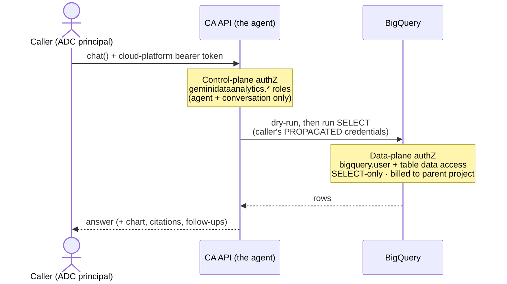
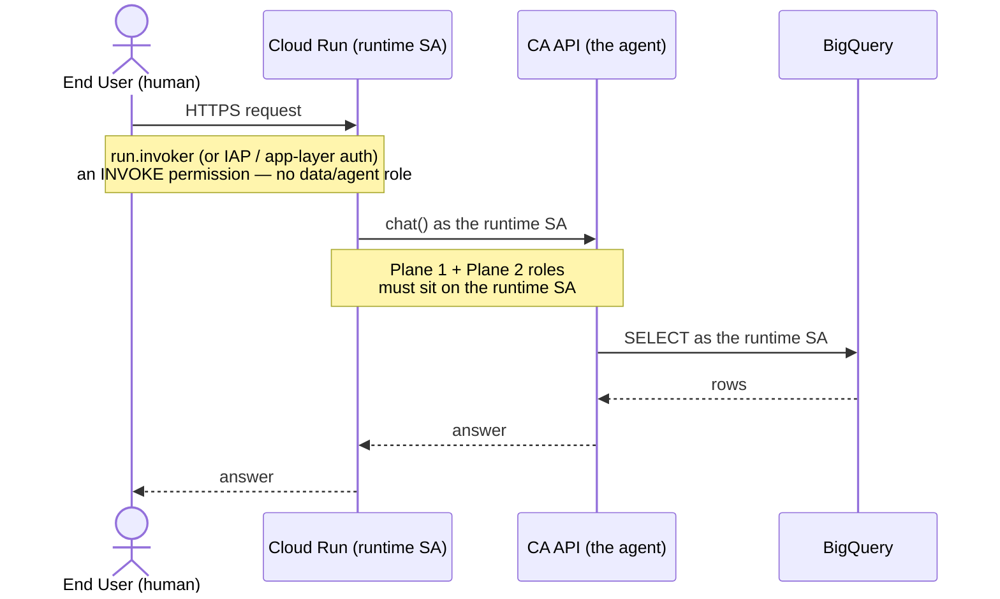

# 🔐 Permissions & Identity

Who can use a BigQuery CA agent, whose identity reaches BigQuery, and how that
changes when the code is deployed on Cloud Run — plus a runnable demo
([`cloud_run_demo/`](cloud_run_demo/)) that proves it. For the invocation
approaches themselves see
[../connection_approaches/README.md](../connection_approaches/README.md); shared
setup is in the [repo README](../README.md).

Access to the Conversational Analytics API splits into **two independent planes**,
enforced by **different IAM** — and, importantly, potentially by **different
identities**:

*   **Control plane** — permission to use the *agent* itself (create it, chat with
    it). Governed by `geminidataanalytics.*` roles.
*   **Data plane** — permission to read the *underlying BigQuery data*. Governed by
    your **BigQuery** IAM, evaluated against the **caller's own credentials**,
    which the API propagates to BigQuery.

The single most important fact: **CA API roles control the agent, not the data.
BigQuery is queried under the caller's identity — not a separate agent/service
identity.**

## 🗺️ The two planes at a glance



## 🛡️ Plane 1 — Access to the agent (control plane)

These predefined roles gate `create` / `list` / `get` / `chat` / `update` /
`delete` on the `dataAgent` (and its conversations). They say **nothing** about
what data the agent can read.

| Role | Key permissions | Used by (this repo) |
|---|---|---|
| `roles/geminidataanalytics.dataAgentCreator` | `dataAgents.create`, `locations.chat` | creating the persistent agent (`agent_stateless` / `agent_stateful` / `agent_a2a`) |
| `roles/geminidataanalytics.dataAgentUser` | `dataAgents.list` / `get` / `chat` | chatting with a published agent |
| `roles/geminidataanalytics.dataAgentStatelessUser` | `locations.chat` | `inline_chat` (no saved agent) |
| `roles/geminidataanalytics.dataAgentOwner` | + `update` / `delete` / `get`\|`setIamPolicy` | sharing / updating an agent's context |

> [!NOTE]
> Stateful conversations (`ConversationReference`,
> `connection_approaches/agent_stateful/main.py`) additionally require
> `roles/cloudaicompanion.user` **and** the `cloudaicompanion.googleapis.com` API
> — this is the IAM counterpart to the `[!CAUTION]` in the *Persistent Agent —
> Stateless Chat* walkthrough in
> [../connection_approaches/README.md](../connection_approaches/README.md).

**APIs to enable:** `geminidataanalytics.googleapis.com` and
`bigquery.googleapis.com` (plus `cloudaicompanion.googleapis.com` for stateful
conversations).

## 🔑 Plane 2 — Access to the BigQuery table (data plane)

This is the crux — *whose* identity reads the data, and what it needs.

*   **Whose identity?** BigQuery is queried under the **caller's own credentials**,
    which the CA API propagates — **not** an agent or service identity. Per the
    docs, the API "queries the connected data source … by using **that user's
    credentials**." In this repo that principal is whoever ran
    `gcloud auth application-default login` (and, for `agent_a2a/main.py`, the
    bearer token minted from that same ADC).
*   **Constructing the query vs. executing it — one identity, not two.** The
    schema/metadata read the agent uses to *reason about and build* the SQL **and**
    the *execution* of the generated `SELECT` both run as the **same caller**,
    each gated by that caller's BigQuery IAM. The docs do **not** split these into
    separate identities or role sets.

| Role | Grants | Covers |
|---|---|---|
| `roles/bigquery.user` (on the billing project) | `bigquery.jobs.create` | dry-run + running the query job; billing |
| `roles/bigquery.dataViewer` (on the dataset/table) | `bigquery.tables.get`, `bigquery.tables.getData` | reading schema/metadata to **construct** the SQL **and** reading rows on **execute** |

This repo makes the split concrete: it reads
`bigquery-public-data.san_francisco.street_trees` (a **public** table any
authenticated principal can read) while jobs bill to a **separate** project
(`kenly-dev-auto-240320261552`) — data-read grant on the *source* table,
job-run/billing grant on the *parent* project.

> [!TIP]
> **The agent is read-only.** Before running, the CA API does a **dry-run** on the
> generated SQL and permits **`SELECT` only** — all DDL/DML is blocked. You can
> also cap scanned bytes with `big_query_max_billed_bytes`. So even a caller with
> write IAM cannot mutate data *through* the agent.

> [!IMPORTANT]
> **Agent IAM ≠ data IAM.** A principal can be `dataAgentUser` on the agent yet
> still get a BigQuery *permission denied* if it lacks `dataViewer` on the table —
> the two planes are checked independently. Because there is **no separate agent
> identity** for BigQuery, least-privilege lives on the **caller's** own BigQuery
> grants. (When deployed behind Cloud Run, "the caller" changes — see below.)

## ☁️ Scenario — deployed behind Cloud Run (who is the "caller"?)

A common production shape: your CA-API code runs on **Cloud Run** and end users
invoke *only* Cloud Run. The key insight: **inside Cloud Run,
`google.auth.default()` resolves to the Cloud Run runtime *service account* via
the metadata server.** So "the caller" from both planes becomes the **Cloud Run
SA** by default — the end user's identity stops at Cloud Run's front door and does
**not** reach the CA API or BigQuery on its own.



The permission table shifts — roles move **from the human onto the SA**, plus a
new invoke row:

| Principal | Needs | Why |
|---|---|---|
| End user (human) | `roles/run.invoker` (or IAP / app-layer auth) | reach the app — **no** GCP agent/data role |
| Cloud Run runtime SA | `geminidataanalytics.dataAgentUser` / `dataAgentStatelessUser` | it is what calls the CA API |
| Cloud Run runtime SA | `roles/bigquery.user` + `roles/bigquery.dataViewer` | it is the propagated identity that reads BigQuery |

> [!NOTE]
> **Keep Cloud Run's own identity downstream?** *Yes — it's the default.* Plain
> ADC ⇒ the CA API call and the BigQuery query both run as the runtime SA. No
> extra code.
>
> **Pass the *end user's* identity all the way to CA API and BigQuery?** *Yes, but
> only via end-user OAuth credential propagation* — the app must obtain the user's
> OAuth access token and build the CA API client with *those* credentials; the API
> then propagates them to BigQuery, restoring per-user BQ IAM. `run.invoker` / IAP
> alone is **not** enough: an IAP signed header only *identifies* the user; it is
> not a credential you can use to call BigQuery *as* them.

> [!CAUTION]
> With the default (runtime-SA) model, BigQuery sees only the **shared SA**, so
> per-end-user BigQuery IAM / row-level security no longer distinguishes users —
> every end user inherits the SA's exact data access. Either enforce per-user
> authorization in the app layer, or propagate the end user's token (above). The
> full set of identity variants — custom SA, impersonation, end-user OAuth — plus
> a runnable demo lives in [**☁️ Deployment & Identity Models**](#-deployment--identity-models).

## 📚 References

*   [Access control](https://docs.cloud.google.com/gemini/data-agents/conversational-analytics-api/access-control) — roles + "uses that user's credentials"
*   [Enable the API](https://docs.cloud.google.com/gemini/data-agents/conversational-analytics-api/enable-the-api) — required roles & APIs
*   [Authentication](https://docs.cloud.google.com/gemini/data-agents/conversational-analytics-api/authentication) — how each data source is authorized
*   [Security & privacy](https://docs.cloud.google.com/gemini/data-agents/conversational-analytics-api/security-privacy-compliance)
*   [FAQ](https://docs.cloud.google.com/gemini/data-agents/conversational-analytics-api/frequently-asked-questions) — read-only / SELECT-only guarantee
*   [Manage costs](https://docs.cloud.google.com/gemini/data-agents/conversational-analytics-api/manage-costs) — billing project, dry-run, `big_query_max_billed_bytes`

## ☁️ Deployment & Identity Models

> [!NOTE]
> These are **generic Cloud Run identity patterns** — they apply to *any*
> downstream GCP call, not just the CA API. The single knob throughout is
> **which credentials you construct the client with**; for BigQuery, the CA API
> propagates *that* identity to the data. Everything below is exercised by the
> runnable [`cloud_run_demo/`](cloud_run_demo/) app.

### The identity knob — one unified table

"Local ADC" is a **local-dev** model, **not** a Cloud Run option (see the caution
below), so it is listed separately as row **L**.

| # | Model | Where | Effective principal at CA API + BQ | How it's set | End user → service/SA IAM | Setup / SA-to-SA IAM |
|---|---|---|---|---|---|---|
| L | User ADC | local only | your user account | `gcloud auth application-default login` | N/A (no Cloud Run) | your user's CA + BQ roles |
| 1 | Default runtime SA | Cloud Run | Compute default SA | deploy with no `--service-account` | `run.invoker` on the **service**; **none on the SA** | deployer needs `actAs` on the default SA (over-privileged — avoid) |
| 2 | Custom runtime SA | Cloud Run | your dedicated SA | `gcloud run deploy --service-account=SA` | `run.invoker` on the **service**; **none on the SA** | deployer needs `roles/iam.serviceAccountUser` (actAs) on the SA |
| 3 | Impersonated SA | Cloud Run | target SA | `impersonated_credentials` in code | `run.invoker` on the **service**; **none on the SA** | runtime SA needs `roles/iam.serviceAccountTokenCreator` on the target SA |
| 4 | End-user OAuth | Cloud Run | the end user | build the client with the user's forwarded OAuth token | `run.invoker` on the **service** **+ the end user's own CA + BQ roles** | app relays the user's token; **no** SA grant over the user |

All rows reach the same conclusion: **CA propagates whatever identity the client
is built with, to BigQuery — one coupled identity.**

> [!NOTE]
> **End users are never granted a role *on* a service account.** They only need
> `roles/run.invoker` on the **service** (model 4 additionally needs the end
> user's *own* CA + BQ roles, because they *become* the effective principal). The
> `actAs` (deploy-time) and `tokenCreator` (impersonation) grants are
> **deployer→SA** and **SA→SA** concerns, orthogonal to the human end user.

> [!CAUTION]
> **"Local ADC on Cloud Run" doesn't exist.** On Cloud Run, ADC always resolves
> to the attached runtime SA via the metadata server — there is no interactive
> user login. Google's docs explicitly warn *"never set
> `GOOGLE_APPLICATION_CREDENTIALS` on a Cloud Run service"*; baking a
> user/SA-key credentials file into the image or a Secret is a discouraged
> anti-pattern (long-lived secret, rotation, leakage). Use an attached custom SA
> (row 2), impersonation (row 3), or Workload Identity Federation instead.

> [!IMPORTANT]
> **No split control-plane / data-plane identity for BigQuery.** You **cannot**
> have the Cloud Run SA hold `geminidataanalytics.*` to call `chat()` while a
> *different* end-user OAuth token is used only for the BigQuery read. `ChatRequest`
> has a single top-level `credentials` field, but the REST reference documents it
> for **Looker only** (Looker OAuth token / API key); the `BigQueryTableReference`
> datasource has **no** credential override. So for BigQuery, model 4 means calling
> `chat()` **entirely** as the end user (both planes = the user). The
> SA-calls-agent / user-reads-data split is real **only for Looker**. This is
> [empirically proven](cloud_run_demo/README.md#-empirical-proof--no-split-identity-for-bigquery)
> by the demo's `validate_identity.sh` (controls A–D).

### Custom runtime SA (model 2) — the recommended default

The least-privilege pattern: a dedicated SA holding *only* what it needs.

```bash
gcloud run deploy sf-trees-demo --source permissions-identity/cloud_run_demo/ \
    --service-account="ca-demo@$PROJECT_ID.iam.gserviceaccount.com" \
    --project="$PROJECT_ID" --region="$REGION" --no-allow-unauthenticated

# Grant that SA the two planes (control + data) and let a user invoke the service.
# The demo chats a PUBLISHED agent via DataAgentContext, so the control-plane role
# is dataAgentUser (get + chat). (Create the agent once with ensure_agent.py, as an
# identity holding dataAgentCreator.)
gcloud projects add-iam-policy-binding "$PROJECT_ID" \
    --member="serviceAccount:ca-demo@$PROJECT_ID.iam.gserviceaccount.com" \
    --role="roles/geminidataanalytics.dataAgentUser"
gcloud projects add-iam-policy-binding "$PROJECT_ID" \
    --member="serviceAccount:ca-demo@$PROJECT_ID.iam.gserviceaccount.com" \
    --role="roles/bigquery.user"           # + bigquery.dataViewer on the dataset/table
gcloud run services add-iam-policy-binding sf-trees-demo \
    --member="user:analyst@example.com" --role="roles/run.invoker" \
    --project="$PROJECT_ID" --region="$REGION"
```

### Impersonation (model 3) — separate "who runs" from "who reads"

The runtime SA mints a token *as* a target SA (which holds the CA + BQ roles).
Grant the runtime SA `roles/iam.serviceAccountTokenCreator` on the target, then:

```python
import google.auth
from google.auth import impersonated_credentials
from google.cloud import geminidataanalytics

source, _ = google.auth.default()
target_creds = impersonated_credentials.Credentials(
    source_credentials=source,
    target_principal="data-reader@PROJECT.iam.gserviceaccount.com",
    target_scopes=["https://www.googleapis.com/auth/cloud-platform"],
)
client = geminidataanalytics.DataChatServiceClient(credentials=target_creds)
# → CA API and BigQuery both see the TARGET SA.
```

### End-user OAuth (model 4) — per-user BigQuery enforcement

Relay the end user's own token so BigQuery evaluates *their* IAM:

```python
from google.oauth2.credentials import Credentials
from google.cloud import geminidataanalytics

user_token = request.headers["Authorization"].removeprefix("Bearer ").strip()
client = geminidataanalytics.DataChatServiceClient(
    credentials=Credentials(token=user_token)
)
# → the WHOLE chat() runs as the end user (both planes at once).
```

> [!NOTE]
> **Does the Cloud Run SA need permission *over* the user, or is it OAuth setup?**
> It's **OAuth setup, not IAM.** The SA does not impersonate the user — it merely
> *relays* the user's token, and the user's authorization rides inside that token.
> What you need:
> *   an **OAuth consent screen + OAuth 2.0 Client ID**, and the user completing an
>     authorization flow requesting a **BigQuery-capable scope**
>     (`…/auth/cloud-platform`, the same scope `chat()` needs);
> *   mind the caveats: a token minted without a BQ scope fails with an
>     *insufficient-scope* error regardless of IAM, and user tokens are ~1h (a
>     refresh token needs offline-access consent + storage).
>
> To mint tokens *as* users **without** per-request consent, use **domain-wide
> delegation** — a Google **Workspace admin** grants the SA's client ID the scopes
> in the Admin console. That is a Workspace-admin configuration for your domain's
> users; it is still **not** an IAM role on a user.

> [!TIP]
> The [`cloud_run_demo/`](cloud_run_demo/) app toggles models **2 / 3 / 4** with a
> single `IDENTITY_MODE` env var, so you can deploy and validate each.
